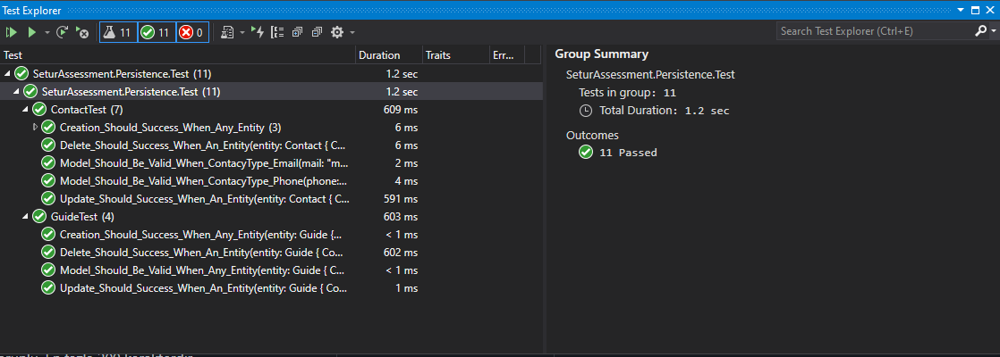

# Setur Assessment
**[İster ve kapsam için tıklayın.](docs/README.MD)**

## Domain
**Guide** Model

| Alan | Tipi | Açıklama |
|:-----|:-----|:---------|
| Id | `Guid` | Zorunlu.|
| Name | `string` | Zorunlu. En fazla 200 karakterdir.|
| Surname | `string` | Zorunlu. En fazla 200 karakterdir.|
| Company | `string` | En fazla 300 karakterdir.|
| Conacts | `Contact[]` | Rehberin iletişim bilgilirini içerir: (Bkz: Contact Model)|
| CreateBy | `string` | Zorunlu. En fazla 200 karakterdir.|
| CreateDate | `DateTime` | Zorunlu.|
| UpdateBy | `string` | Kayıt güncellenirken zorunlu. En fazla 200 karakterdir.|
| UpdateDate | `DateTime` | Kayıt güncellenirken zorunlu. |

**Contact** Model

Guide ile arasinda Bire Çok (One to Many) ilişki vardır. Bir Guide birden fazla Contact gelebilmesidir.

| Alan | Tipi | Açıklama |
|:-----|:-----|:---------|
| Id | `Guid` | Zorunlu.|
| Value | `string` | Zorunlu. En fazla 200 karakterdir.|
| ContactType | `enum` | `EMAIL`: ise `Value` alanına gelecek veri email olmak zorunda. `PHONE`: ise `Value` alanına gelecek veri telefon numarası olmak zorunda. `LOCATION`: ise buraya gelecek veri bulunduğu şehir olmalı.|
| CreateBy | `string` | Zorunlu. En fazla 200 karakterdir.|
| CreateDate | `DateTime` | Zorunlu.|
| UpdateBy | `string` | Kayıt güncellenirken zorunlu. En fazla 200 karakterdir.|
| UpdateDate | `DateTime` | Kayıt güncellenirken zorunlu. |

## Persistence

Persistence katmanında başka bir deyişle data katmanında PostgreSQL kullanılmıştır. CodeFirst olarak tasarlanmıştır.

#### Persistence Test Sonuçları

## Messages