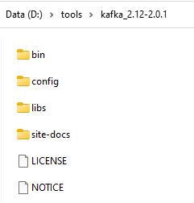
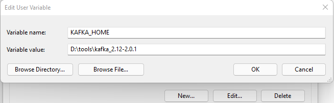
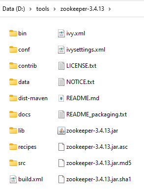
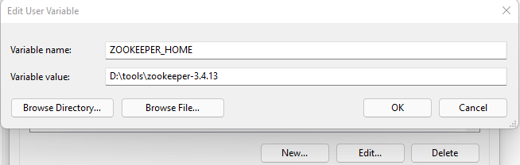

# Setur Assessment
- **[İster ve kapsam için tıklayın.](docs/README.MD)**
- **[Domain](docs/DOMAIN.MD)**
- **[Persistence](docs/PERSISTENCE.MD)**
- **[Messages](docs/MESSAGES.MD)**
- **[Queries ve Commands](docs/QUERIES_COMMANDS.MD)**
___
## Gereksinimler
**1. Kafkayı kurun ve çalıştırın.** Versiyon 2.0.1
- [Kafka'yı indirin.](https://kafka.apache.org/downloads)
- İndirdiğiniz dosyayı bilgisayarınız diskinde uygun gördüğünüz bir klasöre taşıyın. Aşağıdaki gibi;
- 
- Kafka için bilgisayarınızda `Environment Variables` ayarlayın.
- 
- Çalıştırmak için konsola`kafka-server-start.bat %KAFKA_HOME%\config\server.properties` yazın ve enter tuşuna basın.

**2. Zookeper kurun ve çalıştırın.** Versiyon 3.4.13
- [Zookeper'ı indirin.](https://zookeeper.apache.org/releases.html)
- İndirdiğiniz dosyayı bilgisayarınız diskinde uygun gördüğünüz bir klasöre taşıyın. Aşağıdaki gibi;
- 
- Zookeepr için bilgisayarınızda `Environment Variables` ayarlayın.
- 
- Çalıştırmak için konsala`zkserver` yazın ve enter'a basın.

**3. RabbitMQ kurun.**

[https://www.rabbitmq.com/](https://www.rabbitmq.com/)

veya

`choco install rabbitmq`

**4. PostgreSQL** Versiyon 14


#### Kullanılan Topic'ler

`kafka-console-consumer.bat --bootstrap-server localhost:9092 --topic PreparingEvent`

`kafka-console-consumer.bat --bootstrap-server localhost:9092 --topic CompletedEvent`

**PreparingEvent**

Bu event, rapor talep edildiğinde isteği kuyruğa attığını, dinleyen consumer'lar için `Preparing` durumunda event fırlatır. Aynı zamanda rapor talebini database'e `Preparing` satatus'unda kaydeder.

**CompletedEvent**

Bu event ise kuyruğun tamamladığı rapor taleplerini `Copleted` status'üne çekip dinleyen consumer'lar için bir event fırlatır. Aynı zamanda `Preparing` olarak kaydedilmiş status'ü `Completed` olarak günceller.

#### Database Migration

Eğer uygulamaların `appsettings.json` dosyasında bulunan aşağıdaki alanın değerine `InMemory` yazılırsa uygulama InMemory database olarak çalışacaktır.
```xml
"DatabaseConfigurationType": "", // InMemory
```

**SeturAssessment.Api** projesinin database'ni migration yapmak için;

`$ ..\SeturAssessment.Persistence> dotnet ef migrations add Guide-1.0.1 -s ..\SeturAssessment.Api\`

Var olan migration'u database'e update etmek için;

`$ ..\SeturAssessment.Persistence> dotnet ef database update -s ..\SeturAssessment.Api\`


**SeturAssessment.ReportApi** projesinin database'ni migration yapmak için;

`$ ..\SeturAssessment.ReportApi.Application> dotnet ef migrations add Report-1.0.0 -s ..\SeturAssessment.ReportApi\`

Var olan migration'u database'e update etmek için;

`$ ..\SeturAssessment.ReportApi.Application> dotnet ef database update -s ..\SeturAssessment.ReportApi\`

## Nasıl çalışır?